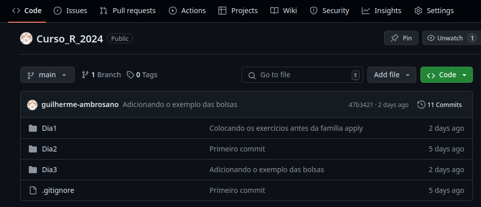

```{r setup, include=FALSE}
knitr::opts_chunk$set(echo = FALSE)
```


# Sumário {.allowframebreaks}
\tableofcontents[subsubsectionstyle=hide]

# -
\section{Material do curso}
\framecard{{\color{white}\Huge{Material do curso}}}

# Material do curso

https://github.com/guilherme-ambrosano/Curso_R_2024



# -
\section{tidyverse}
\framecard{{\color{white}\Huge{tidyverse}}}

# tidyverse

O `tidyverse` é um conjunto de pacotes do R, incluindo:

- \icon `forcats`
- \icon `stringr`
- \icon `lubridate`
- \icon `tibble`
- \icon `readr`
- \icon `readxl`
- \icon `dplyr`
- \icon `tidyr`
- \icon `purrr`
- \icon `ggplot2`

# -
\section{tibble}
\framecard{{\color{white}\Huge{tibble}}}

# tibble

```{r, echo=T}

library(tibble)
load("../dados/Dados.RData")

dados

```

# tibble

```{r, echo=T}

# rownames_to_column, column_to_rownames
rownames_to_column(dados, "id")

```

# tibble

```{r,echo=T}

tibble(numerico=c(1,2,3),
       caractere=c("a","b","c"),
       lógico=c(T,T,F),
       fator=factor(c(1,1,2)))

```

# tibble

```{r,echo=T}

# enframe, deframe
(palavras <- sapply(c("p", "g", "m", "sap"), paste0, "ato"))
enframe(palavras)

```

# -
\section{Pipes (%>%)}
\framecard{{\color{white}\Huge{Pipes (\%>\%)}}}

# Pipes

```{r, echo=T}

funcao <- function(arg1, arg2, arg3) {
  return(c(arg1, arg2, arg3))
}

funcao(1,2,3)

```

# Pipes

```{r, echo=T}

funcao(1,2,3)

```
\pause
```{r, echo=T}

1 %>%
  funcao(2,3)

```
\pause
```{r, echo=T}

1 %>%
  funcao(2,3) %>%
  funcao(4,5)

```

# Pipes

```{r, echo=T}

adicionar_coluna <- function(dados, coluna) {
  dados$coluna2 <- coluna
  return(dados)
}

tibble(coluna1=c(1,2,3)) %>%
  adicionar_coluna(c(4,5,6))

```

# Pipes

```{r, echo=T}

adicionar_coluna <- function(dados, ...) {
  colunas <- list(...)
  sapply(seq(1, length(colunas)),
         function(i) {
           dados[,names(colunas)[i]] <<- colunas[[i]]
         })
  return(dados)
}

tibble(coluna1=c(1,2,3)) %>%
  adicionar_coluna(coluna2=c(4,5,6), 
                   coluna3=c(7,8,9))

```

# Pipes

\begin{figure}
  \raggedright
  \begin{tikzpicture}[font=\ttfamily]
    \node (dados) {conjunto\_de\_dados \%>\%};
    \node (funcao1) [below = .1cm of dados] {    funcao1() \%>\%};
    \node (funcao2) [below = .1cm of funcao1] {    funcao2(opcao)};
  \end{tikzpicture}
\end{figure}

# Pipes

\begin{figure}
  \raggedright
  \begin{tikzpicture}[font=\ttfamily]
    \node (dados) {conjunto\_de\_dados\phantom{ \%>\%}};
    \node (metade) [below left = .05cm and .01cm of dados] {};
    \node (funcao1) [below = .1cm of dados] {    funcao1()\phantom{ \%>\%}};
    \node (metade2) [below = .12cm of metade] {};
    \node (funcao2) [below = .1cm of funcao1] {    funcao2(opcao)};
    \draw (dados.east) |- (metade.west);
    \draw[->] (metade.west) |- (funcao1.west);
    \draw (funcao1.east) |- (metade2.west);
    \draw[->] (metade2.west) |- (funcao2.west);
  \end{tikzpicture}
\end{figure}

# Pipes

\begin{figure}
  \raggedright
  \begin{tikzpicture}[font=\ttfamily]
    \node (dados) {conjunto\_de\_dados};
    \node (funcao1) [right = .5cm of dados] {funcao1()};
    \node (funcao2) [right = .5cm of funcao1] {funcao2(opcao)};
    \draw[->] (dados.east) -- (funcao1.west);
    \draw[->] (funcao1.east) -- (funcao2.west);
  \end{tikzpicture}
\end{figure}

# Pipes

\begin{figure}
  \raggedright
  \begin{tikzpicture}[font=\ttfamily]
    \node (funcao1) {funcao1(conjunto\_de\_dados)};
    \node (funcao2) [right = .5cm of funcao1] {funcao2(opcao)};
    \draw[->] (funcao1.east) -- (funcao2.west);
  \end{tikzpicture}
\end{figure}

# Pipes

\begin{figure}
  \raggedright
  \begin{tikzpicture}[font=\ttfamily]
    \node (funcao2) {funcao2(funcao1(conjunto\_de\_dados), opcao)};
  \end{tikzpicture}
\end{figure}

# -
\section{dplyr}
\framecard{{\color{white}\begin{tabular}{l}
\Huge{Verbos do dplyr} \\
\large{select, filter, mutate, group\_by e summarise}
\end{tabular}}}

# Verbos do dplyr

\small
\begin{figure}
\centering
\begin{tikzpicture}
\node (input) {\begin{tabular}{c} Input\\\scriptsize\textit{Objeto de classe}\\\scriptsize\textit{data frame} \end{tabular}};
\node[rectangle,draw,right=of input] (funcao1) {Função};
\node[right=of funcao1] (output1) {\begin{tabular}{c} Output\\\scriptsize\textit{Objeto de classe}\\\scriptsize\textit{data frame} \end{tabular}};
\draw[->] (input) -- (funcao1);
\draw[->] (funcao1) -- (output1);
\pause
\node[below right= .15cm and .5cm of output1] (pivo1) {};
\node[left= 5.5cm of pivo1] (pivo2) {};
\node[rectangle,draw,below= 1cm of funcao1] (funcao2) {Função};
\node[right= of funcao2] (output2) {\begin{tabular}{c} Output\\\scriptsize\textit{Objeto de classe}\\\scriptsize\textit{data frame} \end{tabular}};
\draw (output1.east) -| (pivo1.north);
\draw (pivo1.north) -- (pivo2.north);
\draw[->] (pivo2.north) |- (funcao2.west);
\draw[->] (funcao2) -- (output2);
\pause
\node[below right= .15cm and .5cm of output2] (pivo3) {};
\node[left= 5.5cm of pivo3] (pivo4) {};
\node[rectangle,draw,below= 1cm of funcao2] (funcao3) {Função};
\node[right= of funcao3] (output3) {\begin{tabular}{c} Output\\\scriptsize\textit{Objeto de classe}\\\scriptsize\textit{data frame} \end{tabular}};
\draw (output2.east) -| (pivo3.north);
\draw (pivo3.north) -- (pivo4.north);
\draw[->] (pivo4.north) |- (funcao3.west);
\draw[->] (funcao3) -- (output3);
\end{tikzpicture}
\end{figure}

# Verbo select

Verbo `select`: selecionar colunas

```{r, echo=T}

mtcars

```


# Verbo select

Verbo `select`: selecionar colunas

```{r, message=F, warning=F, echo=T}

library(dplyr)
mtcars %>%
  select(mpg, cyl, disp)

```


# Verbo select

Verbo `select`: selecionar colunas

```{r, echo=T}

mtcars %>%
  select(-mpg, -cyl, -disp, -gear, 
         -am, -vs, -wt, -carb)

```

# Verbo select

Verbo `select`: selecionar colunas

\footnotesize
```{r, echo=T}

names(iris)

```
\pause
```{r, echo=T}

iris %>%
  select(starts_with("Petal")) %>% head()

```
\pause
```{r, echo=T}

iris %>%
  select(ends_with("Width")) %>% head()

```

# Verbo select

Verbo `select`: selecionar colunas

\small
```{r, echo=T}

iris %>%
  select(matches("[SP]e[tp]al\\.[WL][ie].g?th"))

```


# Verbo filter

Verbo `filter`: filtrar linhas

```{r, echo=T}

mtcars %>%
  filter(hp > 250)

```

# Verbo filter

```{r, echo=T}

mtcars %>%
  filter(hp > 150, hp < 200)

```

# Verbo filter

```{r, echo=T}

mtcars %>%
  filter(hp > 150 & hp < 200)

```


# Verbo filter

```{r, echo=T}

mtcars %>%
  filter(hp > 300 | hp < 60)

```
# Verbo filter

\small
```{r, eval=T, echo=T, warning=F, message=F}

library(readxl)
nomes <- names(read_xls("../dados/diario2023.xls",
                        skip=7, n_max = 0))
diario2023 <- read_xls("../dados/diario2023.xls", skip=10,
                       col_names=nomes) %>%
  filter_all(any_vars(!is.na(.)))

head(diario2023)

```

# dplyr

- \icon Verbo `select`: selecionar colunas
- \icon Verbo `filter`: filtrar linhas
- \icon Verbo `mutate`: criar novas colunas

# Verbo mutate

Verbo `mutate`: criar novas colunas

```{r, echo=T}

tibble(aleatorio1=rnorm(10))

```

# Verbo mutate

Verbo `mutate`: criar novas colunas

```{r, echo=T}

tibble(aleatorio1=rnorm(10)) %>%
  mutate(aleatorio2 = rnorm(10))

```

# Verbo mutate

Verbo `mutate`: criar novas colunas

```{r, echo=T}

tibble(aleatorio1=rnorm(10)) %>%
  mutate(aleatorio2 = rnorm(10)) %>%
  mutate(soma = aleatorio1 + aleatorio2)

```

# Verbo mutate

\small

```{r,echo=T}

tamanhos <- tibble(tam = c(1.5, 1.9, 1.6, 1.8, 2.0, 1.7))

```
\pause
```{r, echo=T}

#tamanhos %>%
#  mutate(classe = 
#           ifelse(tam < median(tam), 
#                  "Pequeno", "Grande"))

tamanhos %>%
  mutate(classe = case_when(
    tam < median(tam) ~ "Pequeno",
    T ~ "Grande"))

```

# Verbo mutate

\small

```{r,echo=T}

#tamanhos %>%
#  mutate(classe = ifelse(
#    tam < quantile(tam, .25), "Muito pequeno", 
#    ifelse(
#      tam < median(tam), "Pequeno", "Grande")))

tamanhos %>%
  mutate(classe = case_when(
    tam < quantile(tam,.25) ~ "Muito pequeno",
    tam < median(tam) ~ "Pequeno",
    T ~ "Grande"))

```


# dplyr

- \icon Verbo `select`: selecionar colunas
- \icon Verbo `filter`: filtrar linhas
- \icon Verbo `mutate`: criar novas colunas
- \icon Verbos `group_by` e `summarise`: agrupar e resumir

# Verbos group_by e summarise

```{r, echo=T}

mtcars %>%
  group_by(cyl) %>%
  summarise(media_hp = mean(hp))

```

# Verbos group_by e summarise

```{r, echo=T}

read_xlsx("../dados/Planilha.xlsx")

```

# Verbos group_by e summarise

\small
```{r, echo=T}

(medidas <- read_xlsx("../dados/Planilha.xlsx") %>%
  mutate(Tamanho = factor(Tamanho, 
                          levels=c("Pequeno", "Médio",
                                   "Grande")),
         Cor = factor(Cor, levels=c("Claro", "Escuro")),
         Repetição = factor(Repetição)))

```


# Verbos group_by e summarise

```{r, echo=T}

medidas %>%
  group_by(Cor) %>%
  summarise(média=mean(Medida))

```

# Verbos group_by e summarise

```{r, echo=T}

medidas %>%
  group_by(Cor) %>%
  summarise(média=mean(Medida, na.rm=T))

```

# Verbos group_by e summarise

```{r, echo=T}

medidas %>%
  group_by(Cor) %>%
  summarise_at(vars(Medida), list(média=mean), na.rm=T)

```

# Verbos group_by e summarise

```{r, echo=T}

medidas %>%
  group_by(Cor) %>%
  summarise_at(vars(Medida), list(média=mean,
                                  desvio=sd), na.rm=T)

```

# Verbos group_by e summarise

```{r, echo=T}

medidas %>%
  group_by(Cor, Tamanho) %>%
  summarise_at(vars(Medida), list(média=mean,
                                  desvio=sd), na.rm=T)

```

# Verbos group_by e summarise

```{r, echo=T}

medidas %>%
  group_by(Cor, Tamanho) %>%
  summarise_at(vars(Medida), list(média=mean,
                                  desvio=sd), na.rm=T) %>%
  summarise_at(vars(média), max)

```

# Verbos group_by e summarise

```{r, echo=T}

medidas %>%
  group_by(Cor, Tamanho) %>%
  summarise_at(vars(Medida), list(média=mean,
                                  desvio=sd), na.rm=T) %>%
  summarise_at(vars(média), max) %>%
  summarise_at(vars(média), sum)

```


# Verbos group_by e summarise

```{r, echo=T}

medidas %>%
  group_by(Cor, Tamanho) %>%
  summarise_at(vars(Medida), list(média=mean,
                                  desvio=sd), na.rm=T) %>%
  ungroup()

```

# dplyr

- \icon Verbo `select`: selecionar colunas
- \icon Verbo `filter`: filtrar linhas
- \icon Verbo `mutate`: criar novas colunas
- \icon Verbos `group_by` e `summarise`: agrupar e resumir
- \icon Verbo `arrange`: ordenar uma variável de maneira crescente ou decrescent (`desc`)
- \icon Verbo `slice`: selecionar linhas pelo número

# Verbos arrange e slice

```{r, echo=T}

mtcars %>%
  arrange(hp)

```

# Verbos arrange e slice

```{r, echo=T}

mtcars %>%
  arrange(desc(hp))

```

# Verbos arrange e slice

```{r, echo=T}

mtcars %>%
  arrange(desc(hp)) %>%
  slice(1:5)

```

# Verbos arrange e slice

```{r, echo=T}

mtcars %>%
  rownames_to_column("carro") %>% 
  arrange(desc(hp)) %>%
  slice(1:5) %>%
  select(carro, hp) %>%
  deframe()

```

# dplyr

\begin{figure}
\centering
\begin{tikzpicture}[fill=orange]

\fill (0,4) circle (1);
\draw (0,4) circle (1)
      (1,4) circle (1);
\node at (0.5,2.5) {Left join};

\fill (6,4) circle (1);
\draw (5,4) circle (1)
      (6,4) circle (1);
\node at (5.5,2.5) {Right join};

\fill (0,0) circle (1);
\scope
\clip (-1,-1) rectangle (2,1)
      (1,0) circle (1);
\fill[fill=white] (0,0) circle (1);
\endscope
\draw (0,0) circle (1)
      (1,0) circle (1);
\node at (0.5,-1.5) {Inner join};

\fill (5,0) circle (1);
\fill (6,0) circle (1);
\draw (5,0) circle (1)
      (6,0) circle (1);
\node at (5.5,-1.5) {Full join};

\end{tikzpicture}
\end{figure}

# União de conjuntos de dados

\scriptsize
```{r, echo=T}

usuarios <- read_xlsx("../dados/Transacoes.xlsx", "usuarios")
transacoes <- read_xlsx("../dados/Transacoes.xlsx", "transacoes")

usuarios
transacoes

```

# União de conjuntos de dados

\small

```{r, echo=T}

transacoes %>%
  left_join(usuarios,by="usuario")

```


# União de conjuntos de dados

\small
```{r, echo=T}

transacoes %>%
  right_join(usuarios,by="usuario")

```

# União de conjuntos de dados

\small

```{r, echo=T}

transacoes %>%
  inner_join(usuarios,by="usuario")

```

# União de conjuntos de dados

\small
```{r, echo=T}

transacoes %>%
  full_join(usuarios,by="usuario")

```
# -
\section{tidyr}
\framecard{{\color{white}\begin{tabular}{l}
\Huge{tidyr} \\
\large{pivot, unnest, separate, unite}
\end{tabular}}}

# tidyr

Funções `pivot_longer` e `pivot_wider`

\scriptsize
```{r, echo=T}

(avaliacoes <- 
   tibble("Avaliação 1" = c(1.50, 1.55, 1.54),
          "Avaliação 2" = c(1.51, 1.56, 1.54)))

```
\pause
```{r, echo=T}

(estados <- 
   tibble(Região = c(rep("Sul", 3), rep("Centro-Oeste", 3)),
          ID = c(1,2,3, 1,2,3),
          Estado = c("RS", "PR", "SC", "MS", "MT", "GO")))

```

# tidyr

Funções `pivot_longer` e `pivot_wider`

```{r, echo=T}

library(tidyr)

avaliacoes %>%
  pivot_longer(cols=c("Avaliação 1", "Avaliação 2"),
               names_to="Avaliação", values_to="Altura (cm)")

```

# tidyr

Funções `pivot_longer` e `pivot_wider`

```{r, echo=T}

estados %>%
  pivot_wider(id_cols=ID, names_from=Região,
              values_from=Estado)

```

# tidyr

```{r, echo=T}

iris

```

# tidyr

```{r, echo=T}

iris %>%
  pivot_longer(c(Petal.Length, Sepal.Length,
                 Petal.Width, Sepal.Width))

```

# tidyr

```{r, echo=T}

iris %>%
  pivot_longer(-Species)

```

# tidyr

```{r, echo=T}

iris %>%
  pivot_longer(c(starts_with("Petal"),
                 starts_with("Sepal")))

```

# tidyr

```{r, echo=T}

iris %>%
  pivot_longer(c(starts_with("Petal"),
                 starts_with("Sepal"))) %>%
  separate(name, c("Parte da flor", "Medida"))

```

# tidyr

```{r, echo=T}

dados

```

# tidyr

```{r, echo=T}

dados %>%
  rownames_to_column("id")

```

# tidyr

```{r, echo=T}

dados %>%
  rownames_to_column("id") %>%
  separate(id, c("Trat", "Rep"))

```

# tidyr

```{r, echo=T}

medidas

```

# tidyr

```{r, echo=T}

medidas %>%
  unite(ID, c(Tamanho, Cor, Repetição))

```

# tidyr

```{r, echo=T}

medidas %>%
  unite(ID, c(Tamanho, Cor, Repetição)) %>%
  column_to_rownames("ID")

```

# tidyr

```{r, echo=T}

excel_sheets("../dados/CaribbeanMaize.xlsx")

```

<!---
# tidyr

```{r,echo=T,eval=F}

lapply(c("Antigua", "StVincent"),
       read_xlsx, path="../dados/CaribbeanMaize.xlsx")

```

# tidyr

```{r,echo=T,eval=F}

lapply(c("Antigua", "StVincent"),
       read_xlsx, path="../dados/CaribbeanMaize.xlsx") %>%
  lapply(pivot_longer, c(-block, -plot), names_to="site", values_to="yield")

```

# tidyr

```{r,echo=T,eval=F}

lapply(c("Antigua", "StVincent"),
       read_xlsx, path="../dados/CaribbeanMaize.xlsx") %>%
  lapply(pivot_longer, c(-block, -plot), names_to="site", values_to="yield") %>%
  tibble(isle=c("Antigua", "StVincent"),
         area=c(280, 345),
         dados=.)


```

--->

# tidyr

```{r,echo=T,eval=T}

lapply(c("Antigua", "StVincent"),
       read_xlsx, path="../dados/CaribbeanMaize.xlsx") %>%
  lapply(pivot_longer, c(-block, -plot), names_to="site", values_to="yield") %>%
  tibble(isle=c("Antigua", "StVincent"),
         area=c(280, 345),
         dados=.) %>%
  unnest(dados)

```

# tidyr

```{r, echo=T}

medidas %>%
  mutate(Medida = replace_na(Medida, 0))

```

# tidyr

Funções do pacote `forcats` para valores ausentes

```{r, echo=T}

library(forcats)

# fct_na_value_to_level
medidas %>%
  mutate(Cor = fct_na_level_to_value(Cor, "Claro"))

```

# -
\section{Exemplo}
\framecard{{\color{white}\Huge{Exemplo}}}

# Exemplo

\small
```{r, echo=T}

library(readr)
(linhas <- read_lines("http://www.leb.esalq.usp.br/leb/exceldados/DCE2023.TXT"))

```

# Exemplo

```{r, echo=T}

library(stringr)
which(str_starts(linhas, "="))

```

\pause

```{r, echo=T}

length(which(str_starts(linhas, "=")))

```

\pause
\small

```{r, echo=T}

which(str_starts(linhas, "="))[c(1, seq(3, 37, 3))] # inicios
which(str_starts(linhas, "="))[c(2, seq(5,37,3), 37)] # finais

```

# Exemplo
\small
```{r, echo=T}

inicio <- which(str_starts(linhas, "="))[c(1, seq(3, 37, 3))]
final <- which(str_starts(linhas, "="))[c(2, seq(5,37,3), 37)]

pular <- sapply(seq(1,13), function(i){
  seq(inicio[i], final[i])
})

pular
```

# Exemplo
```{r,echo=T}
pular2 <- which(linhas=="")

linhas2 <- linhas[-c(unlist(pular),pular2)]
```
# Exemplo
\small
```{r, echo=T}

head(linhas2)

```
\pause
```{r, echo=T}

as_tibble(linhas2)

```
# Exemplo

\tiny
```{r, echo=T}
linhas[c(2, 3, 4, 6)]

```
\scriptsize
```{r, echo=T}
str_replace_all(linhas[6], " +", " ")
linhas2[60]
```

# Exemplo
\small
```{r, echo=T, warning=F, message=F}

as_tibble(linhas2) %>%
  separate(value, 
           c("No", "ANO", "DIA", "MES", "R.GLOBA",
             "INSOLACAO", "PRECIPITACAO", "UMIDADE RELATIV",
             "VENTO MAXIMO", "VENTO MEDIO", "TEMPER MAXIMA",
             "TEMPER MINIMA", "TEMPER MEDIA", "EVAPORACAO"),
           sep=" +")

```


# Exemplo
\small
```{r, echo=T, warning=F, message=F}

as_tibble(linhas2) %>%
  separate(value, 
           c("No", "ANO", "DIA", "MES", "R.GLOBA",
             "INSOLACAO", "PRECIPITACAO", "UMIDADE RELATIV",
             "VENTO MAXIMO", "VENTO MEDIO", "TEMPER MAXIMA",
             "TEMPER MINIMA", "TEMPER MEDIA", "EVAPORACAO"),
           sep=" +") %>%
  unite(Data, DIA, MES, ANO)

```

# Exemplo

\small
```{r, echo=T, warning=F, message=F}

as_tibble(linhas2) %>%
  separate(value, 
           c("No", "ANO", "DIA", "MES", "R.GLOBA",
             "INSOLACAO", "PRECIPITACAO", "UMIDADE RELATIV",
             "VENTO MAXIMO", "VENTO MEDIO", "TEMPER MAXIMA",
             "TEMPER MINIMA", "TEMPER MEDIA", "EVAPORACAO"),
           sep=" +") %>%
  unite(Data, DIA, MES, ANO) %>%
  mutate(Data=lubridate::dmy(Data)) %>%
  mutate_at(vars(-Data), str_replace, ",", ".") %>%
  mutate_at(vars(-Data), parse_number)

```
